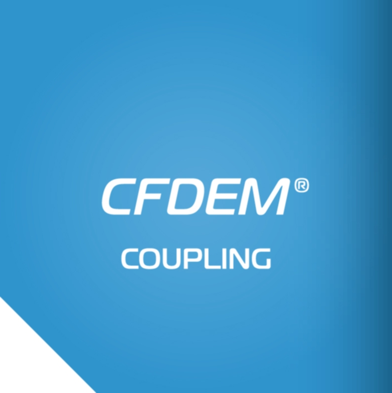
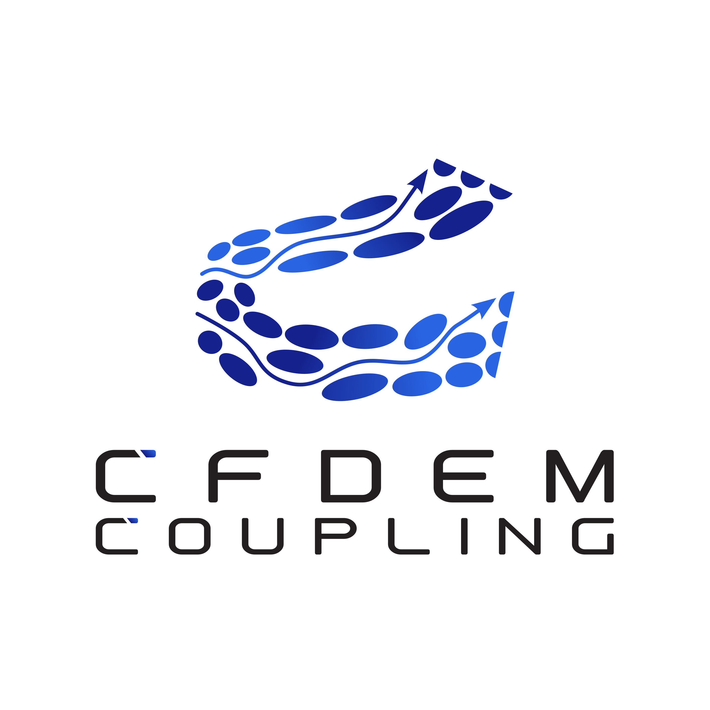

<div align ="center">

<p float="left">
  
   
</p>
  
</div>

## The extended version of CFDEM®coupling is constantly developed and maintained by DCS Computing GmbH - you can find more information [here](https://www.aspherix-dem.com/software/cfdemcoupling-functionalities/)

This repository contains older, publicly available versions of CFDEM®coupling (referred to as "CFDEM®coupling-PUBLIC") and will not be updated in the foreseeable future.

CFDEM®coupling-PUBLIC is compatible with [LIGGGHTS-PUBLIC](https://github.com/CFDEMproject/LIGGGHTS-PUBLIC).

The extended version of CFDEM®coupling is compatible with the DEM software [Aspherix®](https://www.aspherix-dem.com/), the "successor" of LIGGGHTS® developed and distributed by DCS Computing GmbH, Linz, Austria.

</div>

## CFDEM®coupling-PUBLIC

CFDEM®coupling-PUBLIC is an Open Source coupled CFD-DEM framework combining the strengths of LIGGGHTS® DEM code and the Open Source CFD package OpenFOAM® [^1]. CFDEM®coupling stands for Computational Fluid Dynamics (CFD) - Discrete Element Method (DEM) coupling.

LIGGGHTS® and CFDEM® are registered trade marks of DCS Computing GmbH, the producer of the LIGGGHTS® software and the CFDEM®coupling software; see http://www.cfdem.com/terms-trademark-policy for details.

CFDEM®coupling-PUBLIC  is open-source, distributed under the terms of the GNU Public License, version 3 or later. CFDEM®coupling-PUBLIC is part of CFDEM®project: www.liggghts.com | www.cfdem.com. Core developer and main author: Christoph Goniva, christoph.goniva@dcs-computing.com

[^1]: This offering is not approved or endorsed by OpenCFD Limited, the producer of the OpenFOAM software and owner of the OPENFOAM® and OpenCFD® trade marks.

</div>

## Features

* Modular approach that allows users to easily implement new models
* MPI parallelization that enables to use it for large scale problems
* The "forum" (www.cfdem.com) on CFD-DEM gives the possibility to exchange with other users / developers
* The use of GIT allows to easily update to the latest version
* Basic documentation is provided

In this toolbox the particle representation within the CFD solver is organized by "cloud" classes. Key functionalities are organised in sub-models (e.g. force models, data exchange models, etc.), which can easily be selected and combined by dictionary settings.

</div>

## Structure
The CFDEM®coupling-PUBLIC distribution includes the following files and directories:

* `README`: this file
* `COPYING`: the GNU General Public License (GPL) file
* `DISCLAIMER`
* `src`: directory including the source files of the coupling toolbox and models
* `applications`: directory including the solver files for coupled CFD-DEM simulations
* `doc`: directory including the documentation of CFDEM®coupling
* `tutorials`: directory including basic tutorial cases showing the functionality

Details on installation are given on the www.cfdem.com website.

</div>

## License

CFDEM®coupling-PUBLIC is free software; you can redistribute it and/or modify it under the terms of the GNU General Public License as published by the Free Software Foundation; either version 3 of the License, or (at your option) any later version.

CFDEM®coupling is distributed in the hope that it will be useful, but **without any warranty**; without even the implied warranty of **merchantabiity** or **fitness for a particular purpouse**; see the GNU General Public License for more details.

You should have received a copy of the GNU General Public License along with CFDEM®coupling-PUBLIC; if not, write to the Free Software Foundation, Inc., 51 Franklin St, Fifth Floor, Boston, MA 02110-1301 USA.

</div>

## Copyrights
* Copyright 2012-now: DCS Computing GmbH, Linz
* Copyright 2009-2015: JKU Linz

Some parts of CFDEM®coupling are based on OpenFOAM® and Copyright on these parts is held by the OpenFOAM® Foundation (www.openFoam.org) and potentially other parties. Some parts of CFDEMcoupling are contributied by other parties, which are holding the Copyright. This is listed in each file of the distribution.

## How to cite CFDEM®coupling-PUBLIC
If you are using PhasicFlow in your research or industrial work, cite the following [article](https://doi.org/10.1016/j.partic.2012.05.002):
```
@article{goniva2012influence,
  title={Influence of rolling friction on single spout fluidized bed simulation},
  author={Goniva, Christoph and Kloss, Christoph and Deen, Niels G and Kuipers, Johannes AM and Pirker, Stefan},
  journal={Particuology},
  volume={10},
  number={5},
  pages={582--591},
  year={2012},
  publisher={Elsevier}
}
```
